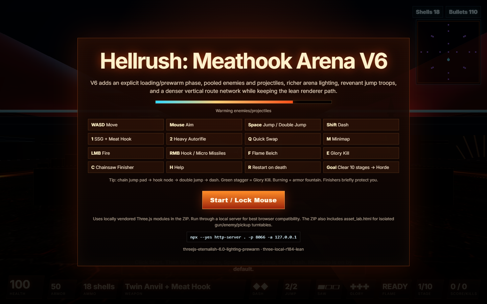

# Hellrush: Meathook Arena



A browser FPS prototype built as a passion-code experiment around the kind of fast, push-forward arena combat I love: double jumps, dash chains, meat-hook movement, resource finishers, chunky weapons, and an arena that keeps asking you to move.

This is not trying to be a commercial clone. It is a small, original Three.js playground for studying that combat rhythm and seeing how far a lightweight browser game can be pushed with generated assets, pooled effects, and aggressive startup prewarming.

## Play

On Windows, double-click:

```text
run_server.bat
```

Then open:

```text
http://127.0.0.1:8066/index.html
```

Or run it manually:

```bash
uv run dev
```

The FastAPI authoring server serves the static game and local labs from the same URL. The project vendors its local Three.js build under `vendor/three`, so it can run without pulling a CDN at startup.

## Controls And Mechanics

- `WASD`: ground movement, air control, strafe routing, and arena circle-strafing.
- Mouse: free-look aiming with pointer lock.
- `Space`: jump and double jump. Jump pads launch higher routes and can be chained into hooks/dashes.
- `Shift`: dash with two charges and quick recharge. Use it for dodges, aerial correction, and hook exits.
- `1`: Super Shotgun loadout. High close-range damage, pellet spread, pump timing, recoil, and the Meat Hook on RMB.
- `2`: Heavy Autorifle loadout. Full-auto pressure on LMB, accurate sustained fire, spinning barrels, and micro missiles on RMB.
- `Q`: quick swap between the two weapons.
- LMB: primary fire. SSG rewards close range; Autorifle rewards tracking and pressure.
- RMB with SSG: Meat Hook demons or purple hook nodes. Hold to pull, strafe during travel, release into momentum. Hooked demons ignite and become armor opportunities.
- RMB with Autorifle: micro missiles with homing and splash damage for clustered enemies.
- `F`: Flame Belch. Burns demons in a cone; burning enemies shed armor when damaged.
- `E`: Glory Kill. Executes green staggered enemies at close range, grants health, consumes/recharges glory charges, and gives brief invulnerability.
- `C`: Chainsaw. Executes close enemies for ammo, uses rechargeable fuel, grants brief invulnerability, and triggers a first-person saw finisher.
- `M`: minimap toggle with player, enemy, and traversal-node visibility.
- `H`: in-game help panel.
- `R`: restart after death.

Other mechanics bundled into the arena: finite staged waves, endless horde after stage 10, husks, imps, revenant jump troops, bruisers, fireballs, melee pressure, stagger windows, burn armor drops, health/armor/ammo pickups, lava damage ticks, moving platforms, vertical launch pads, hook nodes, resource meters, hit flashes, screen shake, synthesized weapon/enemy/UI audio, pooled particles, tracers, decals, explosions, and chainsaw/glory finisher animations.

## What Is In Here

- A single-page Three.js arena FPS in `index.html`, `style.css`, and `src/game.js`.
- Generated hell-material textures in `assets/textures`.
- Meshy-generated Ember Runt character source, reference art, PBR maps, and lean runtime GLBs in `assets/characters/ember-runt`.
- A generated 2:1 equirectangular deep-hell panorama in `assets/skies`, used as the live sky background with PMREM-processed environment lighting for PBR materials.
- A Meshy-generated floating hell platform in `assets/environment/floating-hell-platform`, with concept art, authoring GLB, remeshed runtime GLB, and a simple gameplay collision proxy.
- A local `runtime_asset_lab.html` for environment prefab calibration only: finalized runtime GLBs, local mesh transform, yellow editable collision proxy, explicit manifest save, and query-param preloading for assets such as `?asset=floating-hell-platform`.
- A local `character_lab.html` for inspecting animated GLB characters with runtime PBR/emissive sidecar textures.
- A local `weapon_lab.html` for inspecting procedural or finalized Meshy weapon viewmodels with game-style PBR lighting, bloom, bounds, and first-person camera presets.
- A local `texture_lab.html` for previewing manifest-backed PBR materials on sphere, box, plane, and kit primitives under the game's sky, PMREM environment, bloom, and shadowed lighting.
- A lighting lab mode at `index.html?lightingLab` with fixed camera presets, cinematic lighting defaults, soft shadows, and bloom for iterating on arena lighting, shadows, and material readability without playing the real-time game.
- A local FastAPI authoring server, started with `uv run dev`, that serves the static game and provides narrow save endpoints for lab-authored manifests.
- A startup loading phase that prepares textures, shaders, pooled enemies/projectiles/pickups, the Ember Runt husk asset, combat effects, finisher props, hook visuals, and common audio paths before gameplay begins.
- Level material sets live under `assets/textures/<material>/source` as 2048px base/basecolor/normal/roughness/metalness/height maps generated through Chord.

## Character Asset Flow

Authoring files live beside each character so they can be revisited: source reference image, Meshy output GLBs, high-resolution PBR textures, and metadata. Runtime files live under `assets/characters/<name>/runtime` and are the only assets the game should load directly.

For Ember Runt, the game loads:

```text
assets/characters/ember-runt/runtime/models/ember-runt-walking.glb
assets/characters/ember-runt/runtime/models/material-overrides.json
assets/characters/ember-runt/runtime/textures/*
```

The runtime GLB has embedded texture images stripped out; `material-overrides.json` reattaches the base color, normal, roughness, metallic, and emissive maps. Use `character_lab.html?model=assets/characters/ember-runt/runtime/models/ember-runt-walking.glb%3Fv=ember-runt-v2` to inspect the exact runtime path with cache-busted sidecar textures.

## Environment Asset Flow

Environment assets are treated as prefabs. `runtime_asset_lab.html` edits the prefab's local visual transform and local collision proxy, then saves those values into the runtime manifest only when `Save` is clicked. The level still places each prefab instance separately, so calibrating the asset and deciding where it lives in the arena remain separate steps.

## Weapon Asset Flow

Weapons follow the same authoring/runtime split as characters, but without rigging. Authoring concepts, Meshy downloads, and full PBR maps live under `assets/weapons/<weapon>/authoring`; the game loads only `assets/weapons/<weapon>/runtime/runtime-manifest.json`, `runtime/models/viewmodel.glb`, sidecar material overrides, and runtime textures.

Use `weapon_lab.html` to compare the procedural fallback against the finalized runtime GLB. Once a runtime manifest exists, `src/game.js` loads the weapon during the boot screen, applies sidecar PBR/emissive maps, warms the model with the rest of the scene, and attaches it to the first-person weapon root.

Weapon placement, scale, anchor, and muzzle sockets belong in `weapon_lab.html`; weapons are intentionally not listed in the generic runtime asset lab.

Finalize a Meshy weapon folder with:

```bash
python tools/finalize_weapon_asset.py --weapon-dir assets/weapons/ssg --name "Twin Anvil + Meat Hook"
```

The helper strips embedded GLB images by default, writes compressed runtime maps, generates `models/material-overrides.json`, and writes the attach/muzzle metadata contract used by both the lab and game.

## PBR Texture Flow

Base texture art can be generated first, saved under `assets/textures/<material>/source`, then expanded into PBR maps through a local ComfyUI workflow exported in API format. The current Chord workflow lives at `.tmp/chord_image_to_material.json`; run ComfyUI on `127.0.0.1:8188`, then use:

```bash
python tools/build_pbr_texture.py --slug my-material --name "My Material" --base-image C:\path\to\generated-base.png --keep-workflow-copy
```

The wrapper copies the base image into `assets/textures/my-material/source/my-material_base.png`, uploads it to Comfy, patches the workflow's `LoadImage` node, converts save nodes to temporary previews by default, queues the prompt, downloads basecolor/normal/roughness/metalness/height maps into that same source folder, and writes a report beside the outputs.

The tool updates `assets/textures/manifest.json` by default so the result appears in `texture_lab.html`.

## Current Focus

The project is in a vibe-code prototype phase: feel first, then architecture. The current baseline is tuned around keeping Firefox smooth by avoiding first-use GPU stalls during combat. New effects should be created and drawn during loading, then animated at runtime with transforms, scale, opacity/uniforms, and light intensity.

The current level pass is moving away from fake transparent light geometry toward real shadow-casting lights, rough non-metallic blockout materials, correctly tiled UVs on stretched slabs, and repeatable visual inspection through the lighting lab.

Useful render flags:

```text
index.html?lightingLab
index.html?quality=gameplay
index.html?performance
```
